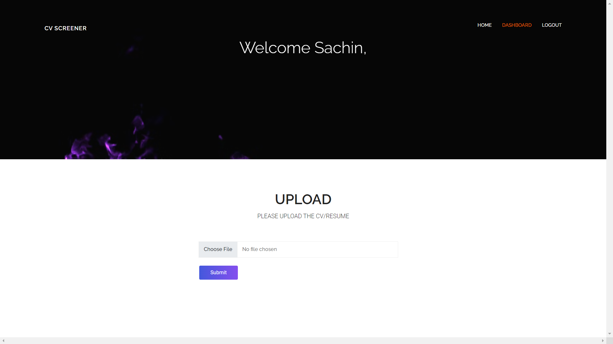

# Resume Screener

## Description

This is a resume screener which summarises the resume and predicts the preferred position for the talent. All the results are rendered in the html template.

## Tools

- Pyresparser
- Spacy
- Flask
- Scikit-learn
- SQLAlchemy
- Docker

## Usage

To use this repo,

- first run the requirement file to install the dependencies  
  `pip3 install -r requirements.txt`
- Next, run the flask app using  
  `python app.py`
